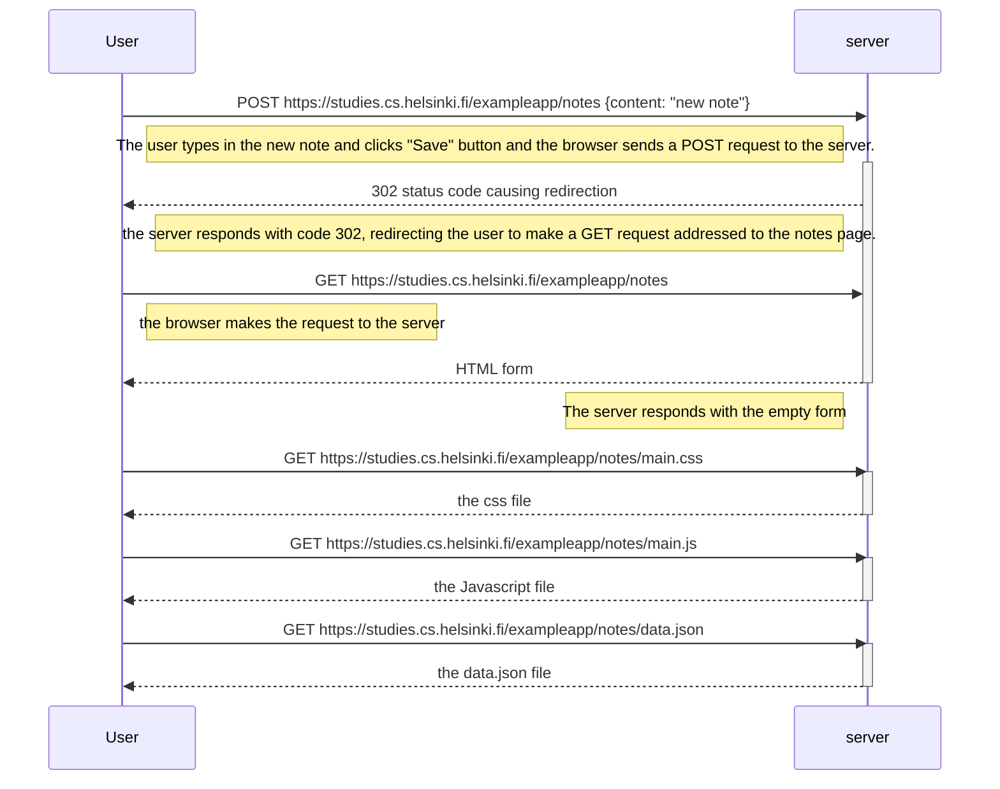

# New Note Diagram

```mermaid
sequenceDiagram
    participant User
    participant server

    User->>server: POST https://studies.cs.helsinki.fi/exampleapp/notes {content: "new note"}

    Note right of User: The user types in the new note and clicks "Save" button and the browser sends a POST request to the server.

    activate server
    server-->>User: 302 status code causing redirection

    Note left of server: the server responds with code 302, redirecting the user to make a GET request addressed to the notes page.

    User->>server: GET https://studies.cs.helsinki.fi/exampleapp/notes

    Note right of User: the browser makes the request to the server

    server-->>User:HTML form
    deactivate server

    Note left of server: The server responds with the empty form 

    User->>server: GET https://studies.cs.helsinki.fi/exampleapp/notes/main.css
    activate server
    server-->>User: the css file
    deactivate server

    User->>server: GET https://studies.cs.helsinki.fi/exampleapp/notes/main.js
    activate server
    server-->>User: the Javascript file
    deactivate server

    User->>server: GET https://studies.cs.helsinki.fi/exampleapp/notes/data.json
    activate server
    server-->>User: the data.json file
    deactivate server

```