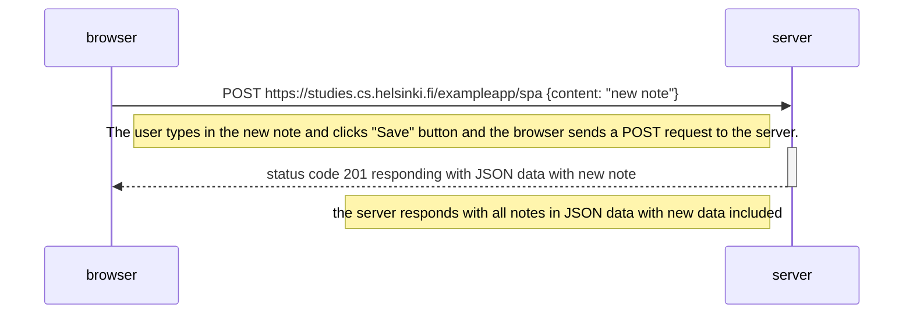

# New Note Diagram

```mermaid
sequenceDiagram
    participant browser
    participant server

    browser->>server: POST https://studies.cs.helsinki.fi/exampleapp/spa {content: "new note"}

    Note right of browser: The user types in the new note and clicks "Save" button and the browser sends a POST request to the server.

    activate server
    server-->>browser: status code 201 responding with JSON data with new note
    deactivate server

    Note left of server: the server responds with all notes in JSON data with new data included

   
```